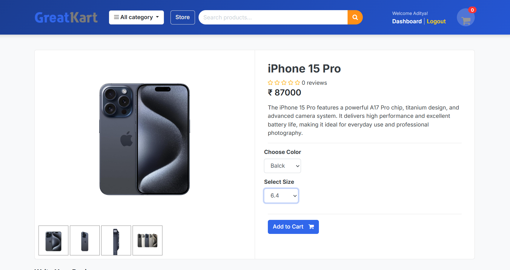
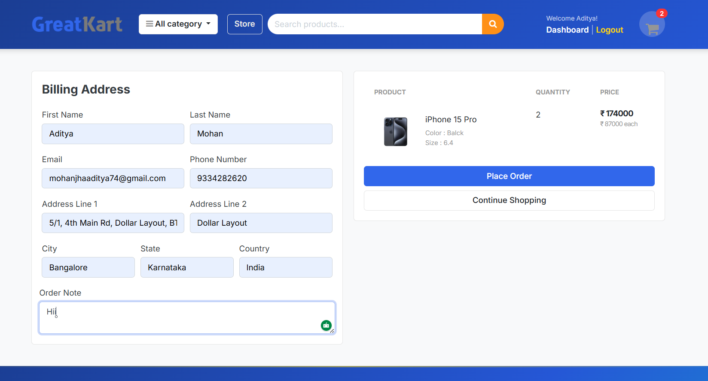
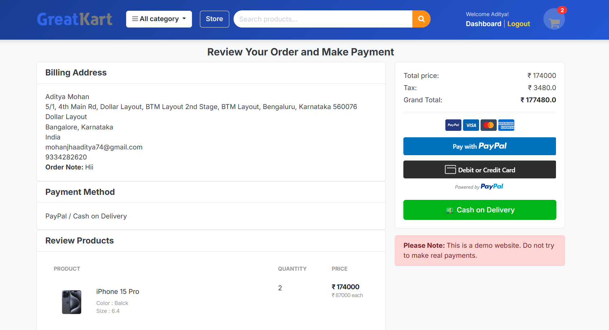
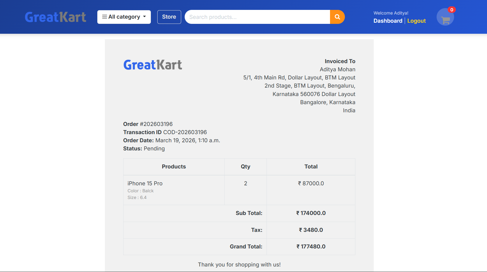

# 🛒 GreatKart – Django E-Commerce Platform

A fully functional e-commerce web application built using Django, designed to handle product listings, user authentication, cart management, and order processing.

---

## 🚀 Features

* 🔐 User Authentication (Login/Register)
* 🛍️ Product Listing & Categories
* 🛒 Add to Cart & Cart Management
* 📦 Order Placement System
* 🧾 Checkout Functionality
* 🖼️ Product Image Gallery
* ⚙️ Django Admin Panel for Management

---

## 🛠️ Tech Stack

* **Backend:** Django, Python
* **Database:** SQLite (can be upgraded to PostgreSQL)
* **Frontend:** HTML, CSS, Bootstrap
* **Tools:** Git, GitHub

---

## 📁 Project Structure

```
greatkart/
├── accounts/
├── carts/
├── category/
├── orders/
├── store/
├── templates/
├── static/
├── manage.py
```

---

## ⚙️ Installation & Setup

```bash
git clone https://github.com/adityamohancse/greatkart.git
cd greatkart
pip install -r requirements.txt
python manage.py runserver
```

---

## 🔑 Admin Access

```bash
python manage.py createsuperuser
```

---

## 📸 Screenshots

### 🏠 Home Page
<p align="center">
  
</p>

### 🛍️ Product Page
<p align="center">
  
</p>

### 🛒 Cart Page
<p align="center">
  
  
</p>

### 🧾 Billing Page
<p align="center">
  
  
</p>

## 🚀 Future Improvements

* Payment Integration (PayPal/Stripe)
* Product Reviews & Ratings
* REST API Integration
* Deployment (PythonAnywhere / AWS)

---

## 👨‍💻 Author

**Aditya Mohan Jha**
B.E. CSE | Django Developer

---

⭐ If you like this project, give it a star!
